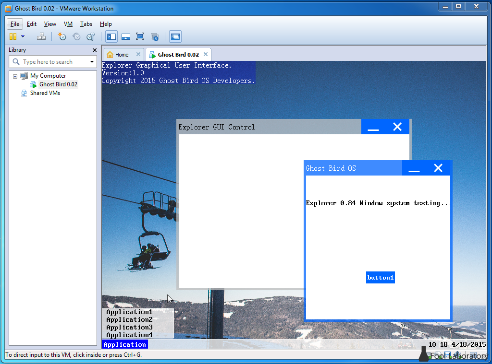

# Ghost Bird Operating System Project #

Copyright 2014-2017 Ghost Bird Operating System Project Developers. All rights reserved.

A lightweight, multi-tasking graphical operating system, **JUST FOR FUN!**

*An old version of Ghost Bird Operating System.*

**NOTE:**All of the following mentioned Ghost Bird OS is the abbreviation of Ghost Bird Opreating System Project.

## How To ##

No one meaningful creation is easy. For your better work, we prepare some docs for you here:

[How to create a unique OS by ourselves?](docs/HowToCreateOS.md "docs/HowToCreateOS.md")

[How to develop OS with us?](docs/HoToTeamWork.md "docs/HoToTeamWork.md")

[How to obtain information through documentation, standards, and protocols](docs/HowToObtainInformation.md "docs/HowToObtainInformation.md")

[How to develop high quality projects](docs/HowToDevelopHighQuality.md "docs/HowToDevelopHighQuality.md")

## Further information ##

[Previous version](docs/PreviousVersion.md "docs/PreviousVersion.md")

[Function we need to do](docs/Plan.md "docs/Plan.md")

[Function we have done](docs/FunctionList.md "docs/FunctionList.md")

You can easily download and participate in the development of Ghost Bird Operating System Project by the following way:

- visited our developer website:[makeos.org](http://makeos.org)
- follow us on github:[GhostBirdOS](https://github.com/GhostBirdOperatingSystemProject/GhostBirdOS)

First of all, Ghost Bird OS isn't a single project, in fact, this is a collection of multiple items, some of the project that make up Ghost Bird OS are as follows:

- Explorer kernel Project
- Explorer loader Project

As a part of development, the function realized by these project are necessary for Ghost Bird OS development. And we recommanded you not just only follow this project but also follow the above items.

## Licensing Terms ##
All of the Ghost Bird OS sources are governed by the terms of the [BSD 2-clause "Simplified" License](https://github.com/MakeOS/GhostBirdOS/blob/master/LICENSE).
