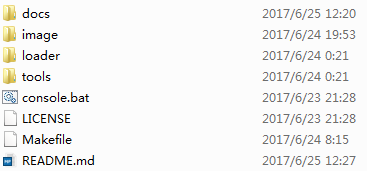
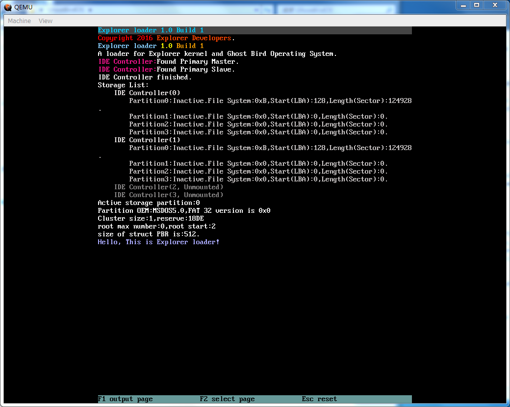

# How To Run #

To make a great project, we try our best to support developers work no matter what platform they are using, such as Windows and Linux, Runing Ghost Bird OS needs steps as follow:

1. Get a stable version of source(release better).
2. Install toolchain, virtual macthine and some other tools you need.
3. Prepare virtual image.
4. Compile the code.

## Get a stable version of source ##

You can easily download and participate in the development of Ghost Bird Operating System Project by the following way:

- visited our developer website:[makeos.org](http://makeos.org)
- follow us on github:[GhostBirdOS](https://github.com/GhostBirdOperatingSystemProject/GhostBirdOS)

In the above site, you can download source code or clone repository to the local(Check [here](https://help.github.com/categories/creating-cloning-and-archiving-repositories/ "Creating, cloning, and archiving repositories") to learn more about repository), if this step is done, the GhostBirdOS directory will be like this(or may be more files):

*My local repository on Windows 7*

**NOTE:** this is the root of GhostBirdOS project.

## Install everything you need ##

We need to use a lot of tools to help us read, write and debug our OS. For example, we need an excllent **code editor** which support highlight and some other extensions to make our develop comfortably, some free license **compiler** and tools to compile, link our C\C++\Assembly language code, after that, we need load our OS files into a virtual image, Ghost Bird File System Reader(or **gfr**) is required, then we need a convenient **virtual machine** to run our system, we can find out some problems, if there are some problem we can't figure out, maybe we need analyze some binary files through **hex editor**, or reverse Engineering through **disassembler**. Notice that it is possible that some compilers are a collection of tool chains(eg. GCC compiler). Besides, A kind of Markdown reader is necessary.

### Recommand on Windows ###

It is difficult for developers to configure tool chains on Windows. so we try to collect some useful tools such as GCC\G++ Compiler, Nasm & AS(as a part of GCC\G++) Assembler, rm command support and GFR to make it easier, and you can download them by check [here](https://github.com/MakeOS/tools/releases "tools"). After download, depress them.

Virtual machine: You can get a stable version of QEMU(a kind of Virtual Machine) by [QEMU.org](http://QEMU.org).

You need not only download, unzip and install tools and QEMU, but also add their directory to PATH Environment Variable in Windows, method: added them into Computer" > "Properties" > "Advanced" > "Environment Variables" > "Path", notice that each separated by an ';'.

**NOTE:**

1. Adding directory to PATH Environment Variable in Windows is very important.
2. All programs and consoles that require PATH Environment Variable need to be restart to support new directory.
3. Ghost Bird File System Reader, or gfr, has its own source directory at */GhostBirdOS/tools/gfr/*, but we also copied the executable program, gfr.exe at collection of tools.

Installing other tools such as code editor or hex editor depands on what you need.

## Prepare virtual image ##

We use the VHD format virtual disk as our system files carrier. This is an excellent format that is widely used by multiple virtual machines, such as QEMU, Oracle VirtualBox, VMware, VirtualPC, etc. Here is introduction from [MSDN-About VHD](https://msdn.microsoft.com/en-us/library/windows/desktop/dd323654(v=vs.85).aspx "About VHD").

> The Virtual Hard Disk (VHD) format is a publicly-available image format specification that allows encapsulation of the hard disk into an individual file for use by the operating system as a virtual disk in all the same ways physical hard disks are used. These virtual disks are capable of hosting native file systems (NTFS, FAT, exFAT, and UDFS) while supporting standard disk and file operations. VHD API support allows management of the virtual disks. Virtual disks created with the VHD API can function as boot disks.

As a part of source, it exist at: */GhostBirdOS/image/image.zip*

before we run OS, *image.vhd* need to be unzip from *image.zip*, you can open  *console.bat* at */GhostBirdOS/*, input command:

    make prepare

you will get *image.vhd* at */GhostBirdOS/image/*.

## Compile the code ##

First of all, Ghost Bird OS isn't a single project, in fact, this is a collection of multiple items, some of the project that make up Ghost Bird OS are as follows:

- Explorer kernel Project
- Explorer loader Project

And, each project has more than one file and one operation. So we write some Makefile at each directory, such as */GhostBirdOS/Makefile*, to help us compile. For more information about makefile, you can visit [here](http://www.gnu.org/software/make/manual/make.html "GNU - make").

open */GhostBirdOS/console.bat*, input command:

    make run

if there is no wrong, you can see the result of runing, it maybe like this:

*result*

If your mouse has click in, you can Press Ctrl+Alt+G to quit.
