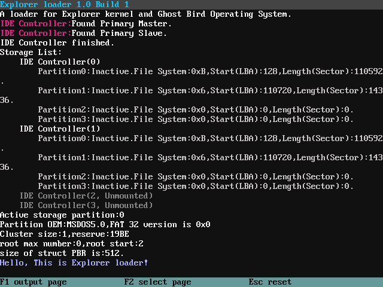
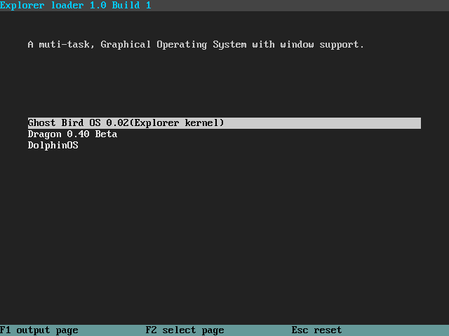

# 引导程序的保留扇区部分 #
Reserved Sector boot section of Explorer kernel loader program.

## 功能描述 ##
初步初始化硬件设备、文件系统，读取引导配置文件，提供可视化界面供用户选择或输出引导状态信息，最终加载目标所需内核。

## 文件结构说明 ##
\Makefile：提供Boot的编译、调试描述。
\README：本文件。用于描述、说明Boot部分。

## 设计思路及实现原理 ##
主引导程序（MBR）将保留扇区引导程序加载到内存后，由保留扇区引导程序进行设备、内存、处理器的初始化以及其他相关的初始化并提供可视化操作界面，最后加载存在于分区中的引导配置文件，由引导配置文件说明内核存在位置，最后将内核加载到指定内存。

## 编译逻辑 ##
在MBR加载保留扇区引导程序后，系统依旧处于16位实模式下，为了保存一些用BIOS功能调用得到的信息，例如内存分段信息以及显示模式信息，同时也为了进入32位保护模式并为执行C代码创造其他条件，我们在引导程序的保留扇区部分中实现了一个16位实模式程序（*setup.bin*)和32位保护模式程序(*boot.bin*)的结合体(*BOOT*)，以下是具体逻辑：

1. 对*setup.basm*进行编译生成无格式二进制文件setup.bin
2. 对其余的C和Assembly文件进行编译分别生成ELF格式
目标文件
3. 将所有ELF格式的目标文件链接生成文件*boot.o*
4. 由*boot.o*去ELF格式生成二进制文件*boot.bin*
5. 二进制拷贝*setup.bin*和*boot.bin*，生成 *BOOT*

## 可视化界面（Visual Interface） ##
这是一个Explorer Loader与用户的交互界面，提供引导阶段的信息输出及选项提供功能，由*VI.c*和*VI.h*负责实现。

VI的界面信息都是可以配置的。该界面的各种元素，如字体颜色、各区域百分比大小、各区域颜色、高亮显示的选择的背景颜色都定义在*../configure.h*中。

可视化界面中的元素分为**页（Page）**和**区域（area）**。其中部分区域附属在某些页中。在这里，页分为输出页、选择页，独立（不属于页中）的区域有标题区域（title area）、注意区域（，非独立区域有介绍区域（introduce area，选择页中）、选择区域（select area，选择页中），输出页和选择页相互独立，即同一时间内只能有其中一个页显示在屏幕上。而针对于界面的任何区域的重编辑，都需要进行重绘工作，其中对于页和非独立区域的重编辑工作中，需要经过判断目标页是否是当前的活动页，若是，才需要进行重绘工作。

由于输出页、介绍区域、选择区域有重绘的需求，所以需要对其数据进行储存。

### 输出页（output page）###

提供信息输出功能，包括如下两个函数：

    /**标准内核信息打印函数*/
    int printk(const char *fmt, ...);
    
    /**高级内核信息打印函数*/
    int printak(const char *fmt, ...);

其中高级内核信息打印函数与前者相比，可以输出不同颜色的信息，便于使用者分析。其用法如下：

    printak("<color_hex>Text here\n</>");

其中的**color_hex**是带有"0x"前缀的24-32位RGB色号，可以参考*/docs/RGB card.png*。

###选择页(select page)###

**选择页**

选择页提供了一个**介绍区域（introduce area）**以及一个**选择区域（select area）**选择区域有一些选项，由介绍区域进行说明。一个常用的场合是启动项选择。

### 开发者提示 ###
**VI.c中所提供的printk函数并没有对参数数量有限制，若有非常规的输出调用，有可能会出现堆栈溢出问题。**

## 储存器（Storage） ##
功能：对计算机的外部储存器管理，并提供有限功能的统一规范的接口。

### 开发者提示 ###
**进行新型外部储存器的接口开发时，务必保证至少下列功能的完整实现：读取/写入、初始化操作。**

## 文件系统（FS） ##
